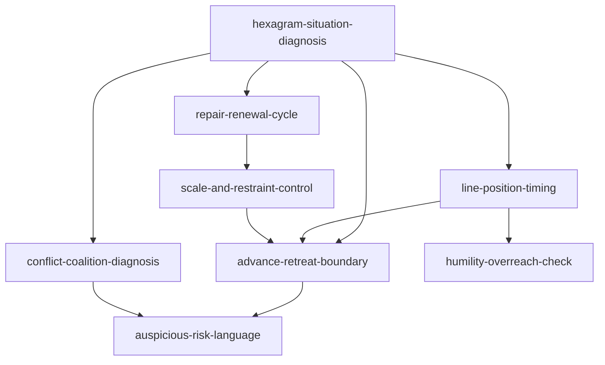

# 《周易》Skill Index

## 产物概览

本目录按仓颉 RIA-TV++ 流程，从 `book-23-周易.epub` 抽取《周易》六十四卦经文，并蒸馏为 8 个可执行 skill。

源文本：`E:\project\cangjie-zhouyi\books\zhouyi\source\zhouyi.txt`

重要限制：当前 EPUB 主要包含卦辞与爻辞，未包含《十翼》长篇传文；本包不做占筮算法和确定性预测。

## Skills

| skill | 何时调用 | 核心动作 |
|---|---|---|
| `hexagram-situation-diagnosis` | 想用《周易》给复杂局面做处境归类 | 匹配 1-3 个候选卦象簇，输出中心张力和下一步 skill |
| `line-position-timing` | 判断现在处在初、二、三、四、五、上哪个阶段 | 识别过早、门槛、承接、高位、尾部风险 |
| `advance-retreat-boundary` | 纠结该进、退、守、待、涉险还是停止 | 把利有攸往、无攸利、勿用、利涉大川转成行动边界 |
| `auspicious-risk-language` | 解释吉、凶、悔、吝、无咎、厉、贞、孚 | 翻译成现代风险等级和补救路径 |
| `humility-overreach-check` | 成功、高位、强势、扩张后怕过头 | 检查亢龙有悔、大壮触藩、丰盛遮蔽、既济终乱 |
| `conflict-coalition-diagnosis` | 处理争端、团队、联盟、共同体和信任 | 区分讼、师、比、同人、睽、解、萃、中孚 |
| `repair-renewal-cycle` | 面对积弊、剥落、修复、改革和新制度 | 排出蛊、剥、复、井、革、鼎、涣、节的修复顺序 |
| `scale-and-restraint-control` | 判断小事/大事、资源/承诺是否错配 | 用小过、大过、小畜、大畜、损、益检查尺度和承载 |

## 调用图

## 推荐使用路径

1. 先用 `hexagram-situation-diagnosis` 判断局面类型。
2. 如果问题是“现在到没到时候”，调用 `line-position-timing`。
3. 如果问题是“该不该动、动多大”，调用 `advance-retreat-boundary` 和 `scale-and-restraint-control`。
4. 如果涉及吉凶悔吝，调用 `auspicious-risk-language` 翻译风险。
5. 如果涉及高位、成功、扩张，调用 `humility-overreach-check`。
6. 如果涉及人和组织，调用 `conflict-coalition-diagnosis`。
7. 如果涉及积弊、旧系统、新制度，调用 `repair-renewal-cycle`。

## 审计文件

- `BOOK_OVERVIEW.md`: Stage 0 整书理解。
- `CANGJIE_ADAPTATION.md`: 针对经典经文的仓颉适配说明。
- `candidates/`: Stage 1 候选池。
- `verified.md`: Stage 1.5 三重验证记录。
- `rejected/`: 拒绝或降级候选。
- 各 skill 目录下 `test-prompts.json`: Stage 4 压力测试用例。
